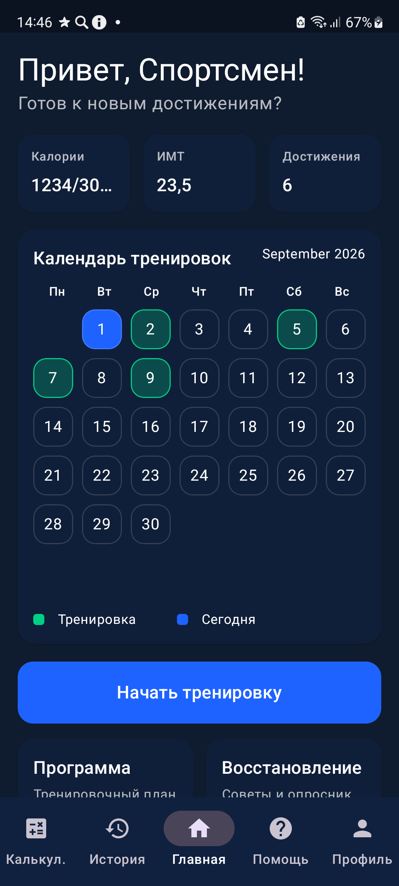
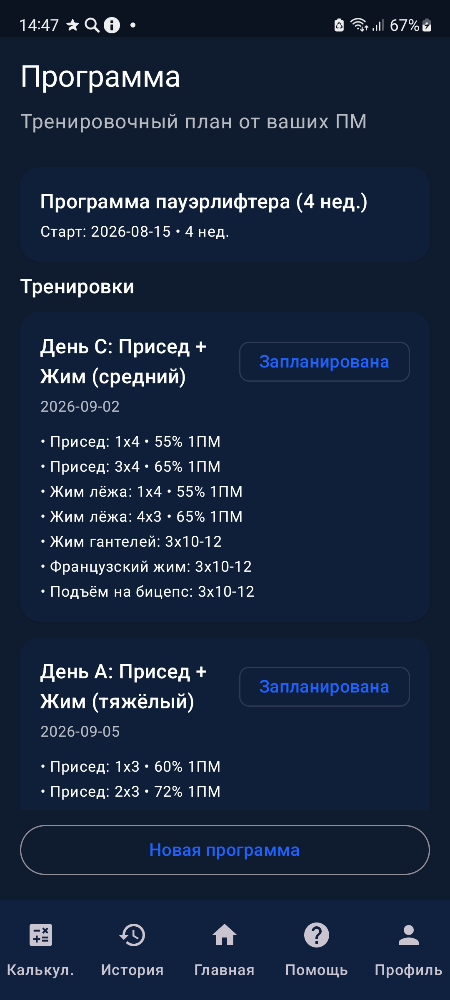
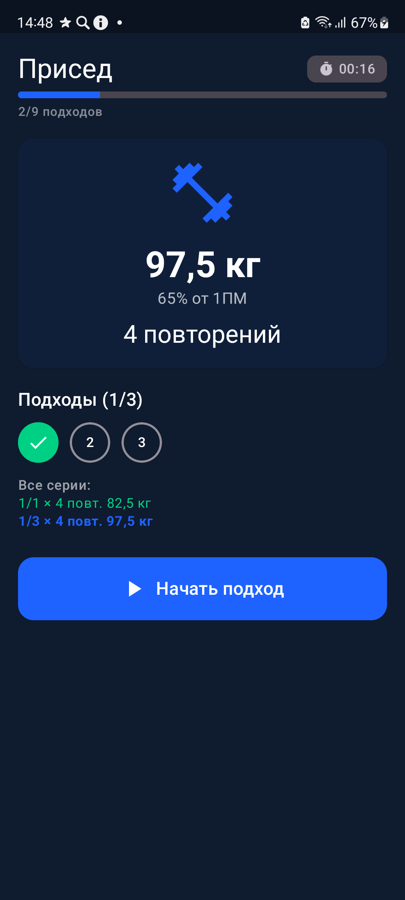
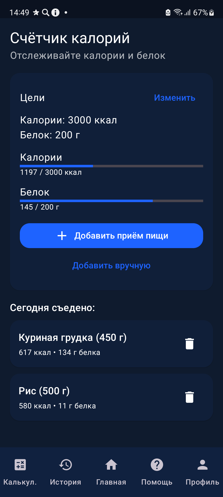

<h1 align="center">🏋️ Powerlifting Assistant</h1>

<p align="center">
  <strong>Android-приложение для пауэрлифтеров: программы тренировок, дневник питания, аналитика и многое другое.</strong>
</p>

<p align="center">
  
  
  
  
  
  <a href="https://github.com/mikhail0vvlad/powerlifting-assistant-android/actions/workflows/android.yml"></a>
</p>

<p align="center">
  
  
  
  
</p>

---

## О проекте

**Powerlifting Assistant** — клиентская часть мобильного приложения для спортсменов-пауэрлифтеров. Приложение взаимодействует с REST API сервером (`api/v1/...`), обеспечивает персонализированную генерацию программ тренировок, отслеживание питания, восстановления и личных рекордов.

Аутентификация выполняется через Firebase Authentication; ID-токен Firebase передаётся серверу в заголовке `Authorization: Bearer <token>` каждого запроса.

---

## Скриншоты

<p align="center">
  
  
  
  
</p>

---

## Функциональность

| Модуль | Описание |
|--------|----------|
| **Авторизация** | Firebase Auth (email + password), определение активной сессии при запуске (`RootNav`) |
| **Главная** | Сводные карточки (калории, ИМТ, достижения), быстрые действия, переход к восстановлению/программе |
| **Программа** | Генерация персональной программы на сервере, активная программа, календарь, перенос/пропуск тренировок |
| **Восстановление** | Опросник (сон, самочувствие, усталость) → старт тренировочной сессии на сервере |
| **Тренировка** | Журнал подходов (вес, повторения, RPE), завершение сессии с итоговой оценкой |
| **История** | Список прошедших тренировок; удаление сессий |
| **Питание** | Дневник КБЖУ на день, цели по калориям/белку, добавление и удаление приёмов пищи |
| **Поиск продуктов** | Поиск по локальному справочнику базовых продуктов + история выбора (DataStore) |
| **Достижения** | Личные рекорды и памятные события: создание и удаление записей |
| **Калькулятор** | Подбор блинов на штангу по заданному рабочему весу |
| **ИМТ** | Расчёт индекса массы тела с интерпретацией |
| **Профиль** | 1RM по приседу/жиму/тяге, рост, вес, цели по питанию; выход из аккаунта |
| **Тема** | Переключение тёмной/светлой темы, сохранение в DataStore |
| **Уведомления** | WorkManager-напоминание (`ReminderWorker`) о питании и календаре |

Нижняя навигация — **5 вкладок**: Калькулятор · История · Главная · Помощь · Профиль. Экраны тренировки и восстановления открываются полноэкранно (без нижней панели).

---

## Архитектура

Проект построен по принципам **Clean Architecture** с разделением на три слоя и MVVM в presentation:

```
presentation/
├── screens/          ← Jetpack Compose UI (экраны)
├── viewmodel/        ← ViewModel + StateFlow, ErrorMapper
├── navigation/       ← RootNav (auth → main) + MainScaffold (NavHost + BottomBar)
└── theme/            ← Material 3 тема

domain/
├── model/            ← Доменные модели (Workout, Program, Nutrition, Achievement, FoodProduct…)
├── repository/       ← Интерфейсы репозиториев
└── usecase/          ← Use case-классы (profile, program, workout, nutrition, achievements)

data/
├── api/              ← Retrofit-интерфейс PowerliftingApi + DTO (ApiModels)
├── repo/             ← Реализации репозиториев
├── mapper/           ← DTO → доменные модели
├── cache/            ← AppCache + MemoryCache (in-memory TTL-кэш)
├── auth/             ← FirebaseTokenProvider (Bearer-токен)
└── local/            ← AppPreferences (DataStore: тема, история поиска)

di/                   ← Hilt-модули (NetworkModule, RepositoryModule)
notifications/        ← WorkManager (ReminderWorker, NotificationUtils)
```

**Паттерн:** MVVM + Clean Architecture (UseCase + Repository)
**DI:** Dagger Hilt (`@HiltAndroidApp`, `SingletonComponent`)
**Навигация:** Navigation Compose — `auth → main`, внутри `main` — 5 вкладок и вложенные маршруты (`calories`, `foodSearch`, `bmi`, `program`, `recovery`, `achievements`, `workout/{sessionId}`)
**Кэширование:** `MemoryCache` с TTL (профиль, питание, программа, календарь, история, достижения), инвалидация после изменений и при смене пользователя

---

## Стек технологий

| Категория | Библиотека / Инструмент |
|-----------|------------------------|
| Язык | Kotlin (JVM target 17) |
| UI | Jetpack Compose (BOM 2024.06.00) + Material 3 + Material Icons Extended |
| Навигация | Navigation Compose 2.8.0 |
| DI | Dagger Hilt 2.51.1 + hilt-navigation-compose |
| Сеть | Retrofit 2.11 + OkHttp 4.12 |
| Сериализация | kotlinx.serialization (JSON) + retrofit2-kotlinx-serialization-converter |
| Auth | Firebase Authentication (Firebase BOM 33.2.0) |
| Хранилище | DataStore Preferences 1.1.1 (тема, история поиска) |
| Фоновые задачи | WorkManager 2.9.1 |
| Асинхронность | Kotlin Coroutines 1.8 + StateFlow |
| Сборка | Gradle Kotlin DSL, kapt |

---

## Сборка

Базовый URL сервера задаётся через `BuildConfig.SERVER_BASE_URL`. Для отладочных сборок используется dev-URL по умолчанию; **release-сборка падает**, если не передан параметр `POWERLIFT_SERVER_BASE_URL`:

```bash
# Debug (по умолчанию используется dev-URL)
./gradlew assembleDebug

# Release (обязателен явный URL сервера)
./gradlew -PPOWERLIFT_SERVER_BASE_URL=https://api.example.com/ assembleRelease
```

Для запуска требуется `app/google-services.json` — конфигурация Firebase:

1. [console.firebase.google.com](https://console.firebase.google.com) → создать проект.
2. Add app → Android, package name `com.powerlifting_assistant`.
3. Включить Authentication → Sign-in method → **Email/Password**.
4. Скачать `google-services.json` и положить в `app/`.

Файл в репозиторий не коммитится (он в `.gitignore`). Backend должен быть
запущен с тем же Firebase-проектом — см.
[powerlifting-assistant-server](https://github.com/mikhail0vvlad/powerlifting-assistant-server).

В debug-варианте подключён `network_security_config` для работы с локальным/dev-сервером.

> **SDK:** minSdk 26, compileSdk / targetSdk 34. Release-сборка использует minify и shrinkResources (ProGuard).

---

## Связанные репозитории

> Серверная часть: **[powerlifting-assistant-server](https://github.com/mikhail0vvlad/powerlifting-assistant-server)** — Ktor + PostgreSQL. Контракт DTO зеркален `data/api/ApiModels.kt`.

---

## Лицензия

Распространяется под лицензией **MIT**. Подробнее см. [LICENSE](LICENSE).
